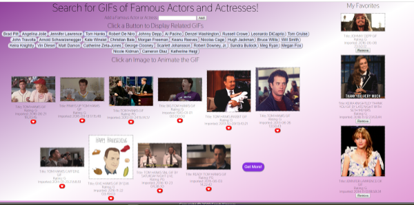

# Giftastic API Search
Dynamic web page that populates with GIFs of famous actors and actresses from the Giphy API and utilizes JavaScript and JQuery to dynamically update the HTML. Limits responses to those rated G or PG. Utilizes local storage to save favorited GIFs.

## Developed by: Sarah Kinneer
## December, 2018

## Technologies Used:
Ajax, GIPHY API, JavaScript, jQuery, Google Fonts, HTML5, CSS3

## Link to Live Site:
- [Play the Game!](https://kinneers.github.io/giftastic) - Head to the live site for some fun!

## To Use the Live Site:
- Click one of the prepopulated buttons OR create a new button using the input field at the top of the page to populate 10 GIF images (all rated G or PG) of the selected actor or actress.
- Click the purple "Get More!" button for the next 10 GIFs from the GIPHY API.
-Choosing a different button at the top of the page will clear the previous selection and return 10 GIFs of the new actor or actress.
- Click the red heart button under a GIF to add it to your favorites along the side of the screen.  Your favorites will persist in local storage on the browser/machine that you are using.
- Click the 'remove' button below a favorited GIF to remove it from the favorites section and local storage.  The GIF will return to the main page.

## Photograph and Sound Sources:
Many thanks to the GIPHY API for creating such a fun tool and sharing it with the world!
